<p align="center">
  
</p>

<h1 align="center">Cloudflare Magic Transit Integration v2.9.17</h1>

<p align="center">
  <strong>Enterprise Magic Transit orchestration platform: Real-time dashboard, intelligent DDoS automation,<br/>custom rules engine, traffic analytics, connectors monitoring, and SOC-ready notifications</strong>
</p>

<p align="center">
  <a href="#features">Features</a> •
  <a href="#web-dashboard">Dashboard</a> •
  <a href="#architecture">Architecture</a> •
  <a href="#scripts">Scripts</a> •
  <a href="#quick-start">Quick Start</a> •
  <a href="#documentation">Documentation</a>
</p>

<p align="center">
  
  
  
  
</p>

<p align="center">
  
  
  
</p>

---

## 🆕 What's New in v2.9.17

### Dashboard Improvements
- **Network Analytics**: Increased event limit from 30 to 100 for better historical visibility

### Webhook Receiver v1.9.0
- **Complete Database Logging**: ALL 11 webhook event types now saved to database
- Previously missing: L7 DDoS, Tunnel Health, Cloudflare Incidents, Health Checks, BGP Hijacks
- Result: Complete event history visible in "DDoS Protection Log" section

### Autowithdraw v3.4
- **Peak Attack Statistics**: Withdraw notifications now show actual attack data
- Before: Showed "0 pkts, 0 Mbps" (current traffic during calm period)
- After: Shows peak values from the attack (e.g., "125,000 pkts, 3.5 Mbps")

---

## Overview

A comprehensive **enterprise-grade Magic Transit orchestration platform** that provides:

- **Real-time Web Dashboard** — Multi-page UI for BGP prefixes, attack events, traffic analytics, and system status
- **Intelligent DDoS Automation** — Auto-withdraw daemon with calm period detection and 15-minute constraint
- **MNM Rules Engine** — Configure BPS/PPS thresholds and sFlow fingerprint-based auto-advertisement
- **DDoS Ruleset Customization** — Fine-tune 124 Cloudflare L3/4 managed rules (block/log/dynamic)
- **Custom Overrides Engine** — Create rules with wirefilter expressions and position control
- **Network Flow Analytics** — 24-hour traffic visibility with top protocols, sources, routers, destinations
- **Connectors Monitoring** — IPsec/GRE tunnels and CNI interconnects with health status and pass rates
- **GeoIP2 Enrichment** — Source IP geolocation, city, ASN in all notifications
- **Multi-source Detection** — Webhooks (push) + GraphQL polling (pull) + real-time traffic analysis
- **SOC-ready Notifications** — Telegram alerts for attacks, advertisements, withdrawals, and service status
- **Complete Audit Trail** — SQLite database with attack correlation, webhook history, and withdrawal records
- **High Availability** — Systemd auto-restart, watchdog monitoring, and service health alerts

### Key Capabilities

| Capability | Description |
|------------|-------------|
| **Web Dashboard** | Real-time monitoring UI with BGP controls, attack events, and traffic analytics |
| **BGP Prefix Management** | One-click advertise/withdraw with 15-minute constraint enforcement |
| **Auto-Withdraw Daemon** | Automatic BGP withdrawal after 15 minutes of calm (no attacks) |
| **Calm Status Tracking** | Real-time countdown to auto-withdraw displayed in dashboard |
| **DDoS Protection Log** | Complete attack lifecycle: ATTACK → ADVERTISE → WITHDRAW |
| **MNM Rules Manager** | Configure BPS/PPS thresholds and sFlow fingerprint rules |
| **DDoS Ruleset Editor** | Customize Cloudflare L3/4 managed rules (block/log/dynamic) |
| **DDoS Custom Overrides** | Create custom rules with wirefilter expressions and position control |
| **Connectors Page** | Monitor IPsec/GRE tunnels and CNI interconnects with health status |
| **Tunnel Health Monitoring** | Real-time pass rate percentage and BGP session status |
| **Network Flow Analytics** | 24-hour traffic stats with top protocols, sources, destinations |
| **Webhook Receiver** | Process 11 Cloudflare alert types with DB logging |
| **GraphQL Polling** | Network analytics monitoring with deduplication |
| **GeoIP2 Enrichment** | Source IP geolocation, city, ASN in notifications |
| **Telegram Notifications** | Real-time SOC alerts for attacks, withdrawals, service status |
| **Attack Detail Modal** | Double-click events to view full attack details and raw payload |
| **Expression Validation** | Real-time wirefilter syntax validation before save |
| **Complete Audit Trail** | SQLite database with attack correlation and history |
| **High Availability** | Systemd auto-restart + watchdog cron + Telegram alerts |
| **Secure Access** | Session-based authentication with bcrypt + IP whitelist |
| **CLI Tools** | Prefix manager, rules manager, autowithdraw with DB logging |
| **Services Watchdog** | Auto-restart failed services with Telegram notification |

---

## Web Dashboard

Real-time monitoring dashboard with dark theme, optimized for SOC environments.

<p align="center">
  
</p>

### Dashboard Features

| Feature | Description |
|---------|-------------|
| **BGP Prefix Management** | View status and advertise/withdraw prefixes with one click |
| **Calm Status Display** | Real-time calm time tracking and auto-withdraw countdown |
| **API Constraint Timer** | Shows 15-minute cooldown for advertise/withdraw actions |
| **DDoS Protection Log** | Attack lifecycle with badges: 🚨 ATTACK, ✅ ENDED, 📡 ADVERTISE, 📤 WITHDRAW |
| **Attack Detail Modal** | Double-click events to view full details, raw payload, Cloudflare links |
| **Analytics Detail Modal** | Double-click to view traffic details, GeoIP info, rule information |
| **Network Flow Stats** | Real-time traffic analytics (24h) with top protocols, sources, destinations |
| **MNM Rules Manager** | Add/edit/delete BPS, PPS, and sFlow threshold rules |
| **DDoS L3/4 Ruleset** | View and customize 124 Cloudflare managed DDoS rules |
| **DDoS Custom Overrides** | Create custom rules with wirefilter expressions and position control |
| **Connectors Monitor** | IPsec/GRE tunnels and CNI interconnects with health status |
| **Tunnel Detail Modal** | Double-click to view/edit tunnel description, MTU, health check |
| **Service Status** | Health monitoring with uptime for all 4 background services |
| **Authentication** | Session-based login with bcrypt password hashing |
| **Password Change** | Change password from dashboard settings (gear icon) |
| **Dark Theme** | SOC-optimized dark theme with responsive design |
| **Auto-refresh** | 30-second automatic refresh with manual refresh button |
| **Toast Notifications** | Success/error feedback for all actions |
| **Connectors Health Indicator** | Status dot (🟢/🟠/🔴) on Connectors button shows tunnel health |

### Dashboard Pages

| Page | URL | Description |
|------|-----|-------------|
| **Main Dashboard** | `/` | Overview with BGP prefixes, attacks, analytics, rules, services |
| **MNM Rules Manager** | `/mnm-rules` | Add/edit/delete BPS, PPS, and sFlow threshold rules |
| **DDoS Rules Manager** | `/ddos-rules` | View 124 rules, filter by action, edit 29 customizable rules |
| **DDoS Rules Filtered** | `/ddos-rules/<action>` | Filter by action: block, log, ddos_dynamic |
| **Connectors** | `/connectors` | IPsec/GRE tunnels and CNI interconnects with health |
| **Login** | `/login` | Authentication with session management |
| **Logout** | `/logout` | Clear session and redirect to login |

### Dashboard Sections (Main Page)

| Section | Cards/Elements | Data Source |
|---------|---------------|-------------|
| **Network Flow (24h)** | 6 stat cards (rates, top protocol/source/router/dest) | GraphQL `mnmFlowDataAdaptiveGroups` |
| **BGP Prefixes** | Prefix cards with advertise/withdraw buttons | Cloudflare REST API |
| **Services Status** | 4 service cards with uptime | systemd `systemctl` |
| **Recent Attacks** | Event table with detail modal | SQLite `attack_events` |
| **MNM Rules** | Rules table with edit/delete | Cloudflare MNM API |
| **Network Analytics** | Dropped traffic table with detail modal | SQLite `network_analytics_events` |
| **DDoS Sensitivity** | 4 stat cards (total, block, dynamic, log) | Cloudflare Rulesets API |

### Event Type Badges (v2.9.8+)

| Badge | Meaning |
|-------|---------|
| 🚨 ATTACK | Attack detected |
| ✅ ENDED | Attack ended |
| 📡 ADVERTISE | Prefix announced via BGP |
| 📤 WITHDRAW | Prefix withdrawn via BGP |

### Action Labels (v2.9.9+)

| Badge | Meaning |
|-------|---------|
| 🛡️ Mitigating | Cloudflare actively mitigating attack |
| 📡 Auto-Advertised | Prefix automatically announced by MNM |
| ✅ Notified | Event logged and Telegram sent |
| 📤 Withdrawn (Auto) | Auto-withdraw after 15 min calm |
| 📤 Withdrawn (Manual) | Manual withdraw via CLI or dashboard |
| 📡 Advertised (Manual) | Manual advertise via CLI or dashboard |
| ⏳ Processing | Event being processed |

### Dashboard API Endpoints

| Endpoint | Method | Description |
|----------|--------|-------------|
| `/api/prefixes` | GET | BGP prefix status with calm tracking |
| `/api/prefix/<cidr>/advertise` | POST | Advertise BGP prefix |
| `/api/prefix/<cidr>/withdraw` | POST | Withdraw BGP prefix |
| `/api/attacks` | GET | Recent attack events |
| `/api/attacks/<id>` | GET | Single attack event details |
| `/api/analytics` | GET | Network analytics events |
| `/api/analytics/<id>` | GET | Single analytics event details |
| `/api/network-flow` | GET | 24h traffic statistics |
| `/api/rules` | GET | MNM rules list |
| `/api/mnm-rules` | GET/POST | MNM rules CRUD |
| `/api/mnm-rules/<id>` | PUT/DELETE | Update/delete MNM rule |
| `/api/ddos-sensitivity` | GET | DDoS ruleset summary |
| `/api/ddos-rules` | GET | All DDoS rules with details |
| `/api/ddos-rules/<rule_id>/update` | POST | Update DDoS rule action |
| `/api/ddos-overrides` | GET/POST | Custom DDoS overrides |
| `/api/ddos-overrides/<id>` | PUT/DELETE | Update/delete override |
| `/api/ddos-overrides/<id>/move` | POST | Reorder override position |
| `/api/ddos-overrides/validate` | POST | Validate wirefilter expression |
| `/api/connectors/tunnels` | GET | GRE/IPsec tunnels |
| `/api/connectors/interconnects` | GET | CNI interconnects |
| `/api/connectors/tunnel-health` | GET | Tunnel health from GraphQL |
| `/api/connectors/health-summary` | GET | Overall connector health (for header indicator) |
| `/api/services` | GET | Service status |
| `/api/stats` | GET | Summary statistics |
| `/health` | GET | Health check endpoint |

### Dashboard Tech Stack

| Component | Technology |
|-----------|------------|
| **Backend** | Flask (Python 3.10+) with Jinja2 templates |
| **Frontend** | HTML5, CSS3 (CSS variables), Vanilla JavaScript |
| **Theme** | Dark theme with CSS custom properties |
| **Icons** | Unicode emoji + inline SVG |
| **Proxy** | Apache2 with `mod_proxy` + SSL termination |
| **SSL** | Let's Encrypt with auto-renewal |
| **Authentication** | Flask sessions + bcrypt password hashing |
| **Database** | SQLite3 with row factory |
| **Auto-refresh** | 30 seconds via JavaScript `setInterval` |
| **Modals** | Custom modal system with ESC/backdrop close |
| **Notifications** | Toast notifications with auto-dismiss |
| **Responsive** | CSS Grid + Flexbox, mobile-friendly |

---

## Features

### Alert Processing

Comprehensive support for **11 Cloudflare alert types**:

| Category | Alert Type | Priority | DB Logging |
|----------|------------|----------|:----------:|
| **DDoS Protection** | `advanced_ddos_attack_l4_alert` | HIGH | ✅ |
| | `dos_attack_l4` | HIGH | ✅ |
| | `dos_attack_l7` | HIGH | ✅ |
| **Magic Network Monitoring** | `fbm_dosd_attack` | HIGH | ✅ |
| | `fbm_volumetric_attack` | MEDIUM | ✅ |
| **Magic Transit** | `fbm_auto_advertisement` | INFO | ✅ |
| | `magic_tunnel_health_check_event` | HIGH | ❌ |
| **Route Leak Detection** | `bgp_hijack_notification` | CRITICAL | ❌ |
| **Platform Status** | `incident_alert` | VARIES | ❌ |
| **Health Checks** | `health_check_status_notification` | MEDIUM | ❌ |

### Unified Withdraw Architecture (v2.1.0+)

**IMPORTANT**: BGP withdrawals are handled **exclusively** by `cloudflare-autowithdraw.service`.


**Why this architecture?**
- Single service handles all withdrawals → no conflicts
- Withdraw based on actual traffic analysis, not webhook timing
- Complete audit trail in shared database
- Robust: even if webhook END is missed, autowithdraw will detect calm period
- CLI operations logged and visible in dashboard (v2.9.15+)

### Network Analytics Monitor with GeoIP2

- **GraphQL Polling**: Query `dosdNetworkAnalyticsAdaptiveGroups` endpoint
- **GeoIP2 Enrichment**: Country, city, ASN for source IPs
- **Spoofed IP Detection**: Private/reserved ranges marked with warning
- **Prefix Filter**: Only notify for your configured prefixes (ignores Cloudflare anycast)
- **Deduplication**: SHA256-based event fingerprinting
- **Gap Prevention**: 15-minute lookback window with 5-minute polling

### DDoS Custom Overrides (v2.9.15+)

Create and manage custom DDoS override rules with Cloudflare's wirefilter expression language:

| Feature | Description |
|---------|-------------|
| **Wirefilter Expressions** | Create rules using IP ranges, ports, protocols, TCP flags |
| **Actions** | `block`, `log`, `managed_challenge`, `js_challenge`, `skip` |
| **Position Control** | Reorder rules via up/down arrows or direct position input |
| **Syntax Validation** | Real-time expression validation before save |
| **Full CRUD** | Create, read, update, delete custom rules |

**Example Expressions:**
```
# Block traffic from specific IP range
ip.src in {192.0.2.0/24 198.51.100.0/24}

# Skip protection for specific destination port
ip.dst.port == 8080

# Block specific TCP flags pattern
tcp.flags.syn && !tcp.flags.ack

# Combine conditions
ip.src in {10.0.0.0/8} && ip.dst.port in {80 443}
```

### Network Flow Analytics (24h)

Real-time traffic visibility from `mnmFlowDataAdaptiveGroups` GraphQL API:

| Stat Card | Color | Description |
|-----------|-------|-------------|
| **Avg Bit Rate** | Blue | Average bandwidth (Mbps) |
| **Avg Packet Rate** | Blue | Average packets per second (kpps) |
| **Top Protocol** | Purple | Highest traffic protocol (TCP/UDP/ICMP/GRE/ESP) |
| **Top Source** | Amber | IP address generating most traffic |
| **Top Router** | Emerald | Router handling most traffic (your edge routers) |
| **Top Destination** | Pink | Most targeted IP address |

### Connectors Management

Monitor and manage Magic Transit connectivity:

| Connector Type | Description |
|----------------|-------------|
| **GRE Tunnels** | Generic Routing Encapsulation tunnels to Cloudflare |
| **IPsec Tunnels** | Encrypted IPsec tunnels with IKEv2 |
| **CNI Interconnects** | Cloudflare Network Interconnect (physical/virtual) |

**Displayed Information:**
- Tunnel endpoints (Cloudflare ↔ Customer)
- Health status with pass rate percentage
- MTU configuration
- BGP session state
- Facility location (CNI)

### MNM Rules (Magic Network Monitoring)

Three types of auto-advertisement triggers:

| Rule Type | Trigger | Use Case |
|-----------|---------|----------|
| **BPS (Bandwidth)** | Traffic exceeds X Gbps for Y minutes | Volumetric attacks |
| **PPS (Packets)** | Packets exceed X kpps for Y minutes | Packet floods |
| **sFlow (Fingerprint)** | Pattern-based detection via sFlow sampling | Advanced attack patterns |

### Telegram Notifications

Real-time SOC-ready notifications for all events:

| Event Type | Notification Content |
|------------|---------------------|
| **Attack Start** | Attack vector, target IP:port, bandwidth, packets/sec |
| **Attack End** | Duration, total mitigated traffic |
| **Auto-Advertise** | Prefix advertised, MNM rule triggered |
| **Auto-Withdraw** | Prefix withdrawn, calm duration, protection time |
| **Service Alert** | Service restart, failure notification |
| **Network Analytics** | Dropped traffic details, GeoIP info |

**Notification Format:**
```
🛡️ CLOUDFLARE DDoS PROTECTION

🚨 ATTACK DETECTED

📍 Target: 203.0.113.50:443
📡 Prefix: 203.0.113.0/24
⚡ Vector: TCP SYN Flood
📊 Rate: 2.5 Gbps / 450 kpps
🌍 Source: US, CN, RU (Top 3)

🔗 Dashboard: https://dash.cloudflare.com/...
```

### High Availability

| Layer | Protection |
|-------|------------|
| **Systemd** | `Restart=always` with `RestartSec` delays |
| **Watchdog** | Cron job every 5 min checks all services |
| **StartLimit** | 5 restarts / 5 min before entering failed state |
| **Telegram** | Alerts on service restart |

---

## Architecture

### System Overview


### Attack Lifecycle (v2.9.9+)

```mermaid
flowchart TD
    A["🚨 ATTACK DETECTED<br>Cloudflare detects DDoS"]
    B["📡 AUTO-ADVERTISE<br>MNM rules trigger BGP announcement"]
    C["WEBHOOK START<br>Receive → DB (mitigating) → Telegram"]
    D["🛡️ MITIGATION ACTIVE<br>Traffic scrubbed"]
    E["✅ ATTACK ENDS<br>Cloudflare sends END webhook"]
    F["AUTO-WITHDRAW MONITORS<br>Checks GraphQL every 60s"]
    G{"15 MIN CALM?"}
    H["📤 WITHDRAW<br>Auto-withdraw performs BGP withdraw"]
    I["TELEGRAM<br>Prefix withdrawn notification"]

    A --> B --> C --> D --> E --> F --> G
    G -->|"Yes"| H --> I
    G -->|"No"| F

    style A fill:#ef4444,stroke:#b91c1c,color:#fff
    style B fill:#f59e0b,stroke:#d97706,color:#fff
    style C fill:#3b82f6,stroke:#1d4ed8,color:#fff
    style D fill:#8b5cf6,stroke:#6d28d9,color:#fff
    style E fill:#10b981,stroke:#059669,color:#fff
    style H fill:#06b6d4,stroke:#0891b2,color:#fff
```



---

## Scripts

### Core Services

| Script | Version | Description | Service |
|--------|---------|-------------|---------|
| `cloudflare-webhook-receiver.py` | v1.9.0 | Webhook receiver - all events logged to DB | `cloudflare-webhook.service` |
| `cloudflare-network-analytics-monitor.py` | v1.3.9 | GraphQL poller with GeoIP2 enrichment | `cloudflare-analytics-monitor.service` |
| `cloudflare-autowithdraw.py` | v3.4 | **ONLY** service that performs BGP withdrawals | `cloudflare-autowithdraw.service` |
| `dashboard/app.py` | v2.9.17 | Web dashboard with prefix management | `cloudflare-dashboard.service` |

### Management Tools

| Script | Version | Description |
|--------|---------|-------------|
| `cloudflare-prefix-manager.py` | v1.4.0 | CLI tool for BGP prefix management (with DB logging) |
| `cloudflare-rules-manager.py` | v1.4 | Interactive MNM rules manager |
| `cloudflare-services-watchdog.sh` | v1.2 | HA watchdog for all services |
| `db_manager.py` | v1.3.0 | Database operations module |

### CLI: cloudflare-prefix-manager

```bash
# Interactive menu
cloudflare-prefix-manager

# View status
cloudflare-prefix-manager status
cloudflare-prefix-manager status 203.0.113.0/24

# Advertise/Withdraw (logged to DB, visible in dashboard)
cloudflare-prefix-manager advertise 203.0.113.0/24
cloudflare-prefix-manager withdraw 203.0.113.0/24
cloudflare-prefix-manager advertise --all
cloudflare-prefix-manager withdraw --all

# List prefixes
cloudflare-prefix-manager list
```

### CLI: cloudflare-autowithdraw

```bash
# Run as daemon (systemd)
python3 cloudflare-autowithdraw.py daemon

# Check status
python3 cloudflare-autowithdraw.py status

# Manual operations
python3 cloudflare-autowithdraw.py withdraw 192.0.2.0/24
python3 cloudflare-autowithdraw.py withdraw  # All advertised
python3 cloudflare-autowithdraw.py advertise 192.0.2.0/24

# Test API
python3 cloudflare-autowithdraw.py test
```

### CLI: cloudflare-rules-manager

```bash
# Interactive menu
python3 cloudflare-rules-manager.py

# Menu options:
# [1] List all rules
# [2] List dynamic rules (zscore)
# [3] List threshold rules (BPS/PPS)
# [4] List advanced DDoS rules (sFlow)
# [5] General status
# [6] Add BPS rule (bandwidth threshold)
# [7] Add PPS rule (packet threshold)
# [8] Add dynamic rule (zscore)
# [9] Add advanced DDoS rule (sFlow)
# [d] Delete single rule
# [t] Delete rules by type
# [s] DDoS protection status (L3/4 Managed Ruleset)
# [l] List customizable DDoS rules
# [m] Modify rule sensitivity/action
# [o] View current overrides
# [e] Export configuration
# [q] Quit
```

---

## Quick Start

### Prerequisites

- Ubuntu 22.04+ / Debian 12+
- Python 3.10+
- Apache 2.4+ with `mod_proxy`
- Cloudflare Magic Transit subscription
- GeoIP2 databases (optional, for IP enrichment)

### Installation

```bash
# Clone repository
git clone https://github.com/paolokappa/Cloudflare_Magic_Transit_API_Automations_Monitoring.git
cd Cloudflare_Magic_Transit_API_Automations_Monitoring

# Install Python dependencies
pip3 install -r requirements.txt

# Configure credentials
cp config/settings.json.example config/settings.json
cp config/prefix_mapping.json.example config/prefix_mapping.json
cp config/auth.json.example config/auth.json
nano config/settings.json  # Add your API tokens

# Install systemd services
sudo cp systemd/*.service /etc/systemd/system/
sudo systemctl daemon-reload
sudo systemctl enable cloudflare-webhook cloudflare-analytics-monitor cloudflare-autowithdraw cloudflare-dashboard

# Install cron jobs
sudo cp cron/* /etc/cron.d/

# Start services
sudo systemctl start cloudflare-webhook cloudflare-analytics-monitor cloudflare-autowithdraw cloudflare-dashboard
```

### Configuration

#### settings.json

```json
{
  "cloudflare": {
    "account_id": "YOUR_ACCOUNT_ID",
    "api_token": "YOUR_API_TOKEN",
    "webhook_secret": "YOUR_WEBHOOK_SECRET"
  },
  "telegram": {
    "bot_token": "YOUR_BOT_TOKEN",
    "chat_id": "YOUR_CHAT_ID"
  }
}
```

#### auth.json (Dashboard Authentication)

```json
{
  "username": "admin",
  "password_hash": "YOUR_BCRYPT_HASH",
  "last_changed": "2026-01-01T00:00:00Z"
}
```

Generate password hash:
```python
import bcrypt
password = "your_secure_password"
hash = bcrypt.hashpw(password.encode(), bcrypt.gensalt()).decode()
print(hash)
```

### Service Management

```bash
# Status
systemctl status cloudflare-webhook cloudflare-analytics-monitor cloudflare-autowithdraw cloudflare-dashboard

# Logs
journalctl -u cloudflare-webhook -f
journalctl -u cloudflare-analytics-monitor -f
journalctl -u cloudflare-autowithdraw -f
journalctl -u cloudflare-dashboard -f

# Restart all
systemctl restart cloudflare-webhook cloudflare-analytics-monitor cloudflare-autowithdraw cloudflare-dashboard
```

---

## Documentation

| Document | Description |
|----------|-------------|
| [DASHBOARD.md](docs/DASHBOARD.md) | **Web dashboard** - authentication, API, configuration |
| [WEBHOOK_RECEIVER.md](docs/WEBHOOK_RECEIVER.md) | Webhook handler - 11 alert types |
| [NETWORK_ANALYTICS_MONITOR.md](docs/NETWORK_ANALYTICS_MONITOR.md) | GraphQL poller with GeoIP2 |
| [AUTOWITHDRAW.md](docs/AUTOWITHDRAW.md) | Auto-withdraw daemon (v3.3) with API fix |
| [PREFIX_MANAGER.md](docs/PREFIX_MANAGER.md) | CLI prefix management tool (v1.4.0 with DB logging) |
| [RULES_MANAGER.md](docs/RULES_MANAGER.md) | MNM rules manager |
| [SERVICES_WATCHDOG.md](docs/SERVICES_WATCHDOG.md) | HA watchdog script |
| [DATABASE.md](docs/DATABASE.md) | Schema & query examples |
| [DB_MANAGER.md](docs/DB_MANAGER.md) | Database operations module |
| [CLOUDFLARE_API_REFERENCE.md](docs/CLOUDFLARE_API_REFERENCE.md) | **Unified API docs** - GraphQL, BGP, MNM, DDoS, Connectors APIs |
| [Cloudflare_Magic_Transit.md](docs/Cloudflare_Magic_Transit.md) | General Magic Transit reference |

---

## Directory Structure

```
cloudflare-magic-transit/
├── config/
│   ├── settings.json.example          # API credentials template
│   ├── prefix_mapping.json.example    # Prefix mapping template
│   └── auth.json.example              # Dashboard auth template
├── scripts/
│   ├── cloudflare-webhook-receiver.py          # Webhook handler (v1.8.0)
│   ├── cloudflare-network-analytics-monitor.py # GraphQL poller + GeoIP2 (v1.3.9)
│   ├── cloudflare-autowithdraw.py              # Auto-withdraw daemon (v3.3)
│   ├── cloudflare-prefix-manager.py            # CLI prefix tool (v1.4.0)
│   ├── cloudflare-rules-manager.py             # MNM rules manager (v1.4)
│   ├── cloudflare-services-watchdog.sh         # HA watchdog (v1.2)
│   └── db_manager.py                           # Database operations (v1.3.0)
├── dashboard/
│   ├── app.py                                  # Flask web dashboard (v2.9.17)
│   ├── templates/
│   │   ├── dashboard.html                      # Main dashboard
│   │   ├── login.html                          # Login page
│   │   ├── mnm_rules.html                      # MNM rules manager
│   │   ├── ddos_rules.html                     # DDoS rules manager
│   │   └── connectors.html                     # IPsec/GRE/CNI page
│   └── static/
│       ├── favicon.ico                         # Browser favicon
│       └── images/                             # Logo images
├── systemd/
│   ├── cloudflare-webhook.service
│   ├── cloudflare-analytics-monitor.service
│   ├── cloudflare-autowithdraw.service
│   └── cloudflare-dashboard.service
├── cron/
│   └── cloudflare-services-watchdog
├── docs/                                        # Documentation
│   ├── CLOUDFLARE_API_REFERENCE.md              # Unified API documentation
│   └── images/                                  # Screenshots
├── db/                                          # SQLite database
├── logs/                                        # Application logs
└── requirements.txt                             # Python dependencies
```

---

## Version History

| Version | Date | Changes |
|---------|------|---------|
| **2.9.16** | 2026-01-22 | **Network Analytics Status Indicator** - Dynamic status in card header shows monitoring state (⏸️ Paused / ✅ Active) based on BGP prefix status |
| **2.9.16** | 2026-01-22 | **Analytics Monitor v1.3.9** - Bug fix: Improved polling visibility (debug→info logging for heartbeat) |
| **2.9.15** | 2026-01-22 | **Stats API Bug Fixes** - Timestamp format fix (SQLite datetime), stats now show only real attacks (START events) |
| **2.9.15** | 2026-01-22 | **Connectors Health Indicator** - Status dot (🟢/🟠/🔴) on Connectors button, new health-summary API |
| **2.9.13** | 2026-01-22 | **DDoS Custom Overrides** - Full CRUD with wirefilter expressions, position API, expression validation |
| **2.9.12** | 2026-01-21 | **Prefix Manager v1.4.0** - ADVERTISE/WITHDRAW logged to DB, visible in dashboard |
| **2.9.11** | 2026-01-21 | **Autowithdraw v3.3** - Critical API endpoint fix for detecting advertised prefixes |
| **2.9.10** | 2026-01-21 | Dashboard: Attack events ordering fix (ORDER BY created_at DESC) |
| **2.9.9** | 2026-01-21 | **Webhook v1.8.0** - Auto-advertisement logging, DDoS shows "mitigating" action |
| **2.9.8** | 2026-01-21 | Dashboard: User-friendly event labels (🚨 ATTACK, ✅ ENDED, 📡 ADVERTISE, 📤 WITHDRAW) |
| **2.9.7** | 2026-01-21 | Dashboard: Attack Detail Modal cleanup, db_manager v1.3.0 |
| **2.9.6** | 2026-01-21 | **Webhook v1.7.0** - MNM alerts now saved to database |
| **2.9.0-2.9.5** | 2026-01-21 | Connectors page, button styling, footer readability |
| **2.8.0** | 2026-01-21 | Attack Event Detail Modal (double-click rows) |
| **2.7.0** | 2026-01-21 | **Calm Status Display** - Real-time calm tracking and auto-withdraw countdown |
| **2.6.0** | 2026-01-21 | **Web Dashboard Authentication** - Login page, session management |
| **2.5.0** | 2026-01-21 | **Network Flow Stats** - Real-time traffic analytics (24h) |
| **2.4.0** | 2026-01-20 | **Web Dashboard v1.0** - Real-time monitoring UI |
| **2.3.0** | 2026-01-20 | Rules Manager v1.4: DDoS Sensitivity Management |
| **2.2.0** | 2026-01-19 | Network Analytics Monitor v1.3.1: GeoIP2 integration |
| **2.1.0** | 2026-01-19 | **Unified withdraw architecture** - autowithdraw only |
| **2.0.0** | 2026-01-19 | GitHub repository published |
| **1.0.0** | 2026-01-18 | Initial release |

---

## Technology Stack

### Languages & Frameworks

| Language | Usage | Percentage |
|----------|-------|:----------:|
| **Python 3.10+** | Backend services, API clients, database operations | 64% |
| **HTML/CSS/JavaScript** | Web dashboard, responsive UI, real-time updates | 35% |
| **Bash** | Watchdog scripts, system automation, cron jobs | 1% |

### Python Dependencies

| Package | Purpose |
|---------|---------|
| `flask` | Web dashboard framework |
| `requests` | HTTP client for Cloudflare API |
| `bcrypt` | Password hashing |
| `geoip2` | GeoIP2 database reader (optional) |
| `sqlite3` | Database operations (built-in) |

### External Services

| Service | Integration |
|---------|-------------|
| **Cloudflare API** | REST + GraphQL for Magic Transit |
| **Telegram Bot API** | Real-time SOC notifications |
| **GeoIP2 Databases** | IP geolocation enrichment |
| **Let's Encrypt** | TLS certificates |

---

## Database Schema

SQLite database with event correlation and audit trail:

| Table | Purpose | Key Fields |
|-------|---------|------------|
| `attack_events` | All attack lifecycle events | event_type, attack_id, prefix, timestamp |
| `withdrawal_history` | Completed BGP withdrawals | prefix, protection_duration, method |
| `webhook_events` | All received webhooks | alert_type, event_state, payload |
| `network_analytics_events` | Dropped traffic events | source_ip, dest_ip, attack_vector, geoip |
| `prefix_calm_status` | Real-time calm tracking | prefix, calm_minutes, dropped_bits |

### Quick Database Queries

```bash
# Recent attacks
sqlite3 db/magic_transit.db "SELECT event_type, prefix, created_at FROM attack_events ORDER BY id DESC LIMIT 10;"

# Withdrawal history
sqlite3 db/magic_transit.db "SELECT prefix, withdrawn_at, protection_duration_seconds/60 as minutes FROM withdrawal_history ORDER BY id DESC LIMIT 10;"

# Today's events
sqlite3 db/magic_transit.db "SELECT * FROM attack_events WHERE date(created_at) = date('now');"
```

---

## Security

- **HTTPS Only**: All traffic encrypted via TLS (Let's Encrypt)
- **Authentication**: Session-based login with bcrypt password hashing
- **IP Whitelist**: Dashboard restricted to authorized networks
- **Signature Verification**: Optional HMAC validation of webhooks
- **Localhost Binding**: Flask binds to 127.0.0.1 only
- **Credential Isolation**: API tokens in separate config files
- **No Credentials in Repo**: All sensitive data via config files

```bash
# Restrict config file permissions
chmod 600 config/settings.json
chmod 600 config/prefix_mapping.json
chmod 600 config/auth.json
```

---

## Troubleshooting

### Common Issues

| Issue | Solution |
|-------|----------|
| **Webhook not receiving** | Check Apache proxy, Flask service, firewall |
| **No Telegram notifications** | Verify bot token and chat ID in settings.json |
| **Prefix won't advertise** | Check 15-minute constraint, API token permissions |
| **GeoIP not working** | Install GeoIP2 databases in `/usr/share/GeoIP/` |
| **Dashboard 403** | Check IP whitelist in Apache config |

### Health Check

```bash
# Quick health check
curl -s http://localhost:8081/health | jq

# Service status
systemctl status cloudflare-{webhook,analytics-monitor,autowithdraw,dashboard}

# Recent logs
journalctl -u cloudflare-autowithdraw -n 50 --no-pager

# Database integrity
sqlite3 db/magic_transit.db "PRAGMA integrity_check;"
```

### Testing Webhook

```bash
# Send test webhook
curl -X POST http://localhost:8080/webhook/cloudflare \
  -H "Content-Type: application/json" \
  -d '{"alert_type":"test","data":{"message":"test"}}'

# Test Network Analytics (dry run)
python3 scripts/cloudflare-network-analytics-monitor.py --test --lookback 60
```

---

## License

This project is provided as-is for educational and operational purposes.

---

## Author

<p align="center">
  <strong>Paolo Caparrelli</strong><br/>
  <a href="https://www.goline.ch">GOLINE SA</a><br/>
  <em>Network Security & Infrastructure</em>
</p>

---

<p align="center">
  <strong>Built for SOC Operations</strong><br/>
  <em>Cloudflare Magic Transit On-Demand Integration</em>
</p>
